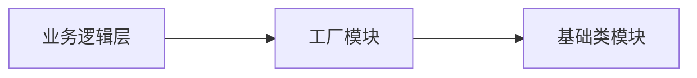

# 常见设计模式-Go实现


[//]: # (featuredImage: "https://cdn.xiaobinqt.cn/xiaobinqt.io/20221111/091d850770dc4f71b6ef1a9ea89a3327.png")

<!-- author： xiaobinqt -->
<!-- email： xiaobinqt@163.com -->
<!-- https://xiaobinqt.github.io -->
<!-- https://www.xiaobinqt.cn -->

## 创建型模式

### 单例模式

保证一个类永远只能有一个对象，并提供一个访问它的全局访问点，且该对象的功能依然能被其他模块使用。

因为在系统内存中只存在一个对象，单例可以节省系统资源。

```go
package main

import (
	"fmt"
	"sync"
	"sync/atomic"
)

//标记
var (
	initialized uint32
	lock        sync.Mutex
	instance    *singelton
)

type singelton struct{}

func GetInstance() *singelton {
	//如果标记为被设置，直接返回，不加锁
	if atomic.LoadUint32(&initialized) == 1 {
		return instance
	}

	//如果没有，则加锁申请
	lock.Lock()
	defer lock.Unlock()

	if initialized == 0 {
		instance = new(singelton)
		//设置标记位
		atomic.StoreUint32(&initialized, 1)
	}

	return instance
}

func (s *singelton) SomeThing() {
	fmt.Println("单例对象的某方法")
}

func main() {
	s := GetInstance()
	s.SomeThing()
}
```

### 简单工厂模式

```
func NewFruit(name string) *Fruit {
	fruit := new(Fruit)

	if name == "apple" {
		//创建apple逻辑
	} else if name == "banana" {
		//创建banana逻辑
	} else if name == "pear" {
		//创建pear逻辑
	}

	return fruit
}
```

如果没有工厂，将对象的初始化代码都集中在一个类中实现，违反了**单一职责原则**，不利于类的重用和维护。当需要加入新的对象时，必须修改基础类的 New 构造函数和其他相关的源代码，违反了**开闭原则**。

简单工厂模式在中间加了一个工厂模块，解决了业务逻辑与基础类的强耦合。简单工厂模式又叫静态方法模式，因为工厂类中定义了一个用于创建对象的方法。简单工厂让使用者不用知道具体的参数就可以创建出所需的“产品”类，即使用者可以直接消费产品而不需要知道产品的具体生产细节。



由:point_down:代码可知，工厂方法模式虽然解决了对象创建和使用的分离，但是同样违反**开闭原则**，因为添加新产品需要修改工厂逻辑，而且工厂会越来越复杂。

```go
package main

import "fmt"

// ======= 抽象层 =========

//水果类(抽象接口)
type Fruit interface {
	Show() //接口的某方法
}

// ======= 基础类模块 =========

type Apple struct {
	Fruit //为了易于理解显示继承(此行可以省略)
}

func (apple *Apple) Show() {
	fmt.Println("我是苹果")
}

type Banana struct {
	Fruit
}

func (banana *Banana) Show() {
	fmt.Println("我是香蕉")
}

type Pear struct {
	Fruit
}

func (pear *Pear) Show() {
	fmt.Println("我是梨")
}

// ========= 工厂模块  =========
//一个工厂， 有一个生产水果的机器，返回一个抽象水果的指针
type Factory struct{}

func (fac *Factory) CreateFruit(kind string) Fruit {
	var fruit Fruit

	if kind == "apple" {
		fruit = new(Apple)
	} else if kind == "banana" {
		fruit = new(Banana)
	} else if kind == "pear" {
		fruit = new(Pear)
	}

	return fruit
}

// ==========业务逻辑层==============
func main() {
	factory := new(Factory)

	apple := factory.CreateFruit("apple")
	apple.Show()

	banana := factory.CreateFruit("banana")
	banana.Show()

	pear := factory.CreateFruit("pear")
	pear.Show()
}

```

### 工厂方法模式

简单工厂模式 + 开闭原则 = [工厂方法模式]^(Factory Method Pattern)

在工厂方法模式中，工厂父类负责定义创建产品对象的公共接口，而工厂子类则负责生成具体的产品对象，这样做的目的是**将产品类的实例化操作延迟到工厂子类中完成**，即通过工厂子类来确定究竟应该实例化哪一个具体产品类。


```go
package main

import "fmt"

// ======= 抽象层 =========

//水果类(抽象接口)
type Fruit interface {
	Show() //接口的某方法
}

//工厂类(抽象接口)
type AbstractFactory interface {
	CreateFruit() Fruit //生产水果类(抽象)的生产器方法
}

// ======= 基础类模块 =========
type Apple struct {
	Fruit //为了易于理解显示继承(此行可以省略)
}

func (apple *Apple) Show() {
	fmt.Println("我是苹果")
}

type Banana struct {
	Fruit
}

func (banana *Banana) Show() {
	fmt.Println("我是香蕉")
}

type Pear struct {
	Fruit
}

func (pear *Pear) Show() {
	fmt.Println("我是梨")
}

// ========= 工厂模块  =========
//具体的苹果工厂
type AppleFactory struct {
	AbstractFactory
}

func (fac *AppleFactory) CreateFruit() Fruit {
	var fruit Fruit

	//生产一个具体的苹果
	fruit = new(Apple)

	return fruit
}

//具体的香蕉工厂
type BananaFactory struct {
	AbstractFactory
}

func (fac *BananaFactory) CreateFruit() Fruit {
	var fruit Fruit

	//生产一个具体的香蕉
	fruit = new(Banana)

	return fruit
}

//具体的梨工厂
type PearFactory struct {
	AbstractFactory
}

func (fac *PearFactory) CreateFruit() Fruit {
	var fruit Fruit

	//生产一个具体的梨
	fruit = new(Pear)

	return fruit
}

//======= 业务逻辑层 =======
func main() {
	/*
		为了突出根据依赖倒转原则与面向接口编程特性。
		一些变量的定义将使用显示类型声明方式
	*/

	//需求1：需要一个具体的苹果对象
	//1-先要一个具体的苹果工厂
	var appleFac AbstractFactory
	appleFac = new(AppleFactory)
	//2-生产相对应的具体水果
	var apple Fruit
	apple = appleFac.CreateFruit()

	apple.Show()

	//需求2：需要一个具体的香蕉对象
	//1-先要一个具体的香蕉工厂
	var bananaFac AbstractFactory
	bananaFac = new(BananaFactory)
	//2-生产相对应的具体水果
	var banana Fruit
	banana = bananaFac.CreateFruit()

	banana.Show()

	//需求3：需要一个具体的梨对象
	//1-先要一个具体的梨工厂
	var pearFac AbstractFactory
	pearFac = new(PearFactory)
	//2-生产相对应的具体水果
	var pear Fruit
	pear = pearFac.CreateFruit()

	pear.Show()

}
```

### 抽象工厂方法模式

[抽象工厂模]^(Abstract Factory Pattern)，提供一个创建一系列相关或相互依赖对象的接口，而无须指定它们具体的类。

工厂方法模式通过引入工厂结构，解决了简单工厂模式中工厂类职责太重的问题，但由于工厂方法模式中的每个工厂只生产一类产品，可能会导致系统中存在大量的工厂类，势必会增加系统的开销。因此，可以考虑将一些相关的产品组成一个“产品族”，由同一个工厂来统一生产，这样，一个工厂可以提供多个产品对象，而不是单一的产品对象。

具体可以参看 [抽象工厂方法模式](https://www.yuque.com/aceld/lfhu8y/hv3rqf)

> 设计一个电脑主板架构，电脑包括：显卡，内存，CPU 3 个固定的插口，显卡具有显示功能`display`（功能实现只要打印出意义即可），内存具有存储功能`storage`，cpu 具有计算功能`calculate`。
>
> 现有 Intel 厂商，nvidia 厂商，Kingston 厂商，均会生产以上三种硬件。
>
> 要求组装两台电脑，
> 1台（Intel的CPU，Intel的显卡，Intel的内存）
>
> 1台（Intel的CPU， nvidia的显卡，Kingston的内存）
>
> 用抽象工厂模式实现。

```go
package main

import "fmt"

/**
设计一个电脑主板架构，电脑包括（显卡，内存，CPU）3个固定的插口，显卡具有显示功能（display，功能实现只要打印出意义即可），
内存具有存储功能（storage），cpu 具有计算功能（calculate）。

现有 Intel 厂商，nvidia 厂商，Kingston 厂商，均会生产以上三种硬件。

要求组装两台电脑， 1台（Intel的CPU，Intel的显卡，Intel的内存）

1台（Intel的CPU， nvidia的显卡，Kingston的内存）

用抽象工厂模式实现。

*/

type AbstractGPU interface {
	Display()
}

type AbstractMemory interface {
	Storage()
}

type AbstractCPU interface {
	Calculate()
}

type AbstractFactory interface {
	CreateGPU() AbstractGPU
	CreateMemory() AbstractMemory
	CreateCPU() AbstractCPU
}

// Intel -----------
type IntelGPU struct {
}

type IntelMemory struct {
}

type IntelCPU struct {
}

func (IntelGPU) Display() {
	fmt.Println("Intel 显卡")
}

func (IntelMemory) Storage() {
	fmt.Println("Intel 内存")
}

func (IntelCPU) Calculate() {
	fmt.Println("Intel 处理器")
}

type IntelFactory struct {
	AbstractFactory
}

func (IntelFactory) CreateGPU() AbstractGPU {
	return new(IntelGPU)
}

func (IntelFactory) CreateMemory() AbstractMemory {
	return new(IntelMemory)
}
func (IntelFactory) CreateCPU() AbstractCPU {
	return new(IntelCPU)
}

//  Nvidia -------------
type NvidiaGPU struct {
}

type NvidiaMemory struct {
}

type NvidiaCPU struct {
}

func (NvidiaGPU) Display() {
	fmt.Println("Nvidia 显卡")
}

func (NvidiaMemory) Storage() {
	fmt.Println("Nvidia 内存")
}

func (NvidiaCPU) Calculate() {
	fmt.Println("Nvidia 处理器")
}

type NvidiaFactory struct {
	AbstractFactory
}

func (NvidiaFactory) CreateGPU() AbstractGPU {
	return new(NvidiaGPU)
}

func (NvidiaFactory) CreateMemory() AbstractMemory {
	return new(NvidiaMemory)
}
func (NvidiaFactory) CreateCPU() AbstractCPU {
	return new(NvidiaCPU)
}

//  Kingston ----------
type KingstonGPU struct {
}

type KingstonMemory struct {
}

type KingstonCPU struct {
}

func (KingstonGPU) Display() {
	fmt.Println("Kingston 显卡")
}

func (KingstonMemory) Storage() {
	fmt.Println("Kingston 内存")
}

func (KingstonCPU) Calculate() {
	fmt.Println("Kingston 处理器")
}

type KingstonFactory struct {
	AbstractFactory
}

func (KingstonFactory) CreateGPU() AbstractGPU {
	return new(KingstonGPU)
}

func (KingstonFactory) CreateMemory() AbstractMemory {
	return new(KingstonMemory)
}
func (KingstonFactory) CreateCPU() AbstractCPU {
	return new(KingstonCPU)
}

func main() {
	/**
	1台（Intel的CPU，Intel的显卡，Intel的内存）
	1台（Intel的CPU， nvidia的显卡，Kingston的内存）
	*/

	var (
		intel    AbstractFactory
		nvidia   AbstractFactory
		kingston AbstractFactory
	)
	intel = new(IntelFactory)
	nvidia = new(NvidiaFactory)
	kingston = new(KingstonFactory)

	intel.CreateCPU().Calculate()
	intel.CreateGPU().Display()
	intel.CreateMemory().Storage()

	fmt.Println("---------------")
	intel.CreateCPU().Calculate()
	nvidia.CreateGPU().Display()
	kingston.CreateMemory().Storage()

}

```

## 结构型模式

### 代理模式


代理模式又叫 Proxy 模式，它可以为其他对象提供一种代理 Proxy 以**控制**对这个对象的访问。代理需要具有与被代理的对象相同的接口的类，客户端必须通过代理与被代理的目标类交互，而**代理一般在交互的过程中（交互前后），进行某些特别的处理**。

```go
package main

import "fmt"

type Goods struct {
	Kind string //商品种类
	Fact bool   //商品真伪
}

// =========== 抽象层 ===========
//抽象的购物主题Subject
type Shopping interface {
	Buy(goods *Goods) //某任务
}

// =========== 实现层 ===========
//具体的购物主题， 实现了shopping， 去韩国购物
type KoreaShopping struct{}

func (ks *KoreaShopping) Buy(goods *Goods) {
	fmt.Println("去韩国进行了购物, 买了 ", goods.Kind)
}

//具体的购物主题， 实现了shopping， 去美国购物
type AmericanShopping struct{}

func (as *AmericanShopping) Buy(goods *Goods) {
	fmt.Println("去美国进行了购物, 买了 ", goods.Kind)
}

//具体的购物主题， 实现了shopping， 去非洲购物
type AfricaShopping struct{}

func (as *AfricaShopping) Buy(goods *Goods) {
	fmt.Println("去非洲进行了购物, 买了 ", goods.Kind)
}

//海外的代理
type OverseasProxy struct {
	shopping Shopping //代理某个主题，这里是抽象类型
}

func (op *OverseasProxy) Buy(goods *Goods) {
	// 1. 先验货
	if op.distinguish(goods) == true {
		//2. 进行购买
		op.shopping.Buy(goods) //调用原被代理的具体主题任务
		//3 海关安检
		op.check(goods)
	}
}

//创建一个代理,并且配置关联被代理的主题
func NewProxy(shopping Shopping) Shopping {
	return &OverseasProxy{shopping}
}

//验货流程
func (op *OverseasProxy) distinguish(goods *Goods) bool {
	fmt.Println("对 [", goods.Kind, "] 进行了辨别真伪.")
	if goods.Fact == false {
		fmt.Println("发现假货", goods.Kind, ", 不应该购买。")
	}
	return goods.Fact
}

//安检流程
func (op *OverseasProxy) check(goods *Goods) {
	fmt.Println("对[", goods.Kind, "] 进行了海关检查， 成功的带回祖国")
}

func main() {
	g1 := Goods{
		Kind: "韩国面膜",
		Fact: true,
	}

	g2 := Goods{
		Kind: "CET4证书",
		Fact: false,
	}

	//如果不使用代理来完成从韩国购买任务
	var shopping Shopping
	shopping = new(KoreaShopping) //具体的购买主题

	//1-先验货
	if g1.Fact == true {
		fmt.Println("对[", g1.Kind, "] 进行了辨别真伪.")
		//2-去韩国购买
		shopping.Buy(&g1)
		//3-海关安检
		fmt.Println("对[", g1.Kind, "] 进行了海关检查， 成功的带回祖国")
	}

	fmt.Println("---------------以下是 使用 代理模式-------")
	var overseasProxy Shopping
	overseasProxy = NewProxy(shopping)
	overseasProxy.Buy(&g1)
	overseasProxy.Buy(&g2)
}
```

### 装饰模式

动态地给一个对象增加一些额外的职责，就增加对象功能来说，装饰模式比生成子类实现更为灵活。

比如`I`接口中有`Create()`方法，当`A`对象实现了`I`接口并调用了`Create()`，但是现在增加，在调用`Create()`后打印下日志的功能，就可以用装饰器。

```go
package main

import "fmt"

type I interface {
	Create()
}

type A struct {
}

func (A) Create() {
	fmt.Println("A create 方法")
	return
}

type Decorator struct {
	i I
}

func (d *Decorator) Create() {
	d.i.Create()
	// 其他的事...
	fmt.Println("还能做点其他的事,比如打印日志...")
}

func main() {
	var a I
	a = new(A)
	a.Create()
	fmt.Println("----- 加上装饰器 ----------")

	var d Decorator
	d = Decorator{
		i: a,
	}
	d.Create()
}
```

### 适配器模式

将一个类的接口转换成客户希望的另外一个接口，使得原本由于接口不兼容而不能一起工作的那些类能一起工作。

[//]: # (![适配器模式]&#40;https://cdn.xiaobinqt.cn/xiaobinqt.io/20221115/001c692e8e4d4f70aabe125a486baf46.png '适配器模式'&#41;)


```go
package main

import (
	"fmt"
)

type OldInterface interface {
	InsertToDatabase(Data interface{}) (bool, error)
}

type AddCustomInfoToMysql struct {
	DbName string
}

func (pA *AddCustomInfoToMysql) InsertToDatabase(info interface{}) (bool, error) {
	switch info.(type) {
	case string:
		fmt.Println("add ", info.(string), " to ", pA.DbName, " successful!")
	}
	return true, nil
}

type NewInterface interface {
	SaveData(Data interface{}) (bool, error)
}

type Adapter struct {
	old OldInterface
}

func (pA *Adapter) SaveData(Data interface{}) (bool, error) {
	fmt.Println("In Adapter")
	return pA.old.InsertToDatabase(Data)
}

func main() {
	var (
		iNew NewInterface
	)

	iNew = &Adapter{
		old: &AddCustomInfoToMysql{
			DbName: "mysql",
		}}
	iNew.SaveData("helloworld")
}
```

### 外观模式


[外观模式]^(Facade Pattern)又称为 Facade 门面模式。Facade 模式为一组具有类似功能的类群，比如类库，子系统等，提供一个一致的简单的界面，这个一致的简单的界面被称作 facade。

外观模式对客户端屏蔽了子系统组件，减少了客户端所需处理的对象数目，并使得子系统使用起来更加容易。通过引入外观模式，客户端代码将变得很简单，与之关联的对象也很少。

外观模式实现了子系统与客户端之间的松耦合关系，这使得子系统的变化不会影响到调用它的客户端，只需要调整外观类即可。

```go
package main

import "fmt"

//电视机
type TV struct{}

func (t *TV) On() {
	fmt.Println("打开 电视机")
}

func (t *TV) Off() {
	fmt.Println("关闭 电视机")
}

//电视机
type VoiceBox struct{}

func (v *VoiceBox) On() {
	fmt.Println("打开 音箱")
}

func (v *VoiceBox) Off() {
	fmt.Println("关闭 音箱")
}

//灯光
type Light struct{}

func (l *Light) On() {
	fmt.Println("打开 灯光")
}

func (l *Light) Off() {
	fmt.Println("关闭 灯光")
}

//游戏机
type Xbox struct{}

func (x *Xbox) On() {
	fmt.Println("打开 游戏机")
}

func (x *Xbox) Off() {
	fmt.Println("关闭 游戏机")
}

//麦克风
type MicroPhone struct{}

func (m *MicroPhone) On() {
	fmt.Println("打开 麦克风")
}

func (m *MicroPhone) Off() {
	fmt.Println("关闭 麦克风")
}

//投影仪
type Projector struct{}

func (p *Projector) On() {
	fmt.Println("打开 投影仪")
}

func (p *Projector) Off() {
	fmt.Println("关闭 投影仪")
}

//家庭影院(外观)
type HomePlayerFacade struct {
	tv    TV
	vb    VoiceBox
	light Light
	xbox  Xbox
	mp    MicroPhone
	pro   Projector
}

//KTV模式
func (hp *HomePlayerFacade) DoKTV() {
	fmt.Println("家庭影院进入KTV模式")
	hp.tv.On()
	hp.pro.On()
	hp.mp.On()
	hp.light.Off()
	hp.vb.On()
}

//游戏模式
func (hp *HomePlayerFacade) DoGame() {
	fmt.Println("家庭影院进入Game模式")
	hp.tv.On()
	hp.light.On()
	hp.xbox.On()
}

func main() {
	homePlayer := new(HomePlayerFacade)

	homePlayer.DoKTV()

	fmt.Println("------------")

	homePlayer.DoGame()
}
```

## 行为型模式

### 命令模式


命令模式可以将请求发送者和接收者完全解耦，发送者与接收者之间没有直接引用关系，发送请求的对象只需要知道如何发送请求，而不必知道如何完成请求。命令模式可以进行存储，延后执行。

```go
package main

import "fmt"

type Command interface {
	Execute()
}

type MoveCommand struct {
	x, y int64
}

func (m *MoveCommand) Execute() {
	fmt.Printf("向右移动%d，向上移动%d \n", m.x, m.y)
}

type AttackCommand struct {
	skill string
}

func (a *AttackCommand) Execute() {
	fmt.Printf("使用技能%s\n", a.skill)
}

func AddCommand(action string) Command {
	if action == "attack" {
		return &AttackCommand{
			skill: "野蛮冲撞",
		}
	} else { //默认是移动
		return &MoveCommand{
			x: 10,
			y: 20,
		}
	}
}

func main() {
	//将命令记录
	lc := make([]Command, 0)
	lc = append(lc, AddCommand("attack"))
	lc = append(lc, AddCommand("move"))
	lc = append(lc, AddCommand("move"))
	lc = append(lc, AddCommand("attack"))

	//执行命令
	for _, c := range lc {
		c.Execute()
	}
}
```

### 观察者模式


观察者模式，它定义了一种一对多的关系，让多个观察者对象同时监听某一个主题对象，这个主题对象的状态发生变化时就会通知所有的观察者对象，使得它们能够自动更新自己。

观察者模式是用于建立一种对象与对象之间的依赖关系，一个对象发生改变时将自动通知其他对象，其他对象将相应作出反应。在观察者模式中，发生改变的对象称为观察目标，而被通知的对象称为观察者，一个观察目标可以对应多个观察者，而且这些观察者之间可以没有任何相互联系，可以根据需要增加和删除观察者，使得系统更易于扩展。

```go
package main

import "fmt"

//--------- 抽象层 --------

// Observer 观察者
type Observer interface {
	OnTeacherComming() // 观察者得到通知后要触发的动作
}

// 被观察者
type Notifier interface {
	AddObserver(observer Observer)
	RemoveObserver(observer Observer)
	Notify()
}

//--------- 实现层 --------
//观察者学生
type StuZhang3 struct {
	Badthing string
}

func (s *StuZhang3) OnTeacherComming() {
	fmt.Println("张3 停止 ", s.Badthing)
}

func (s *StuZhang3) DoBadthing() {
	fmt.Println("张3 正在", s.Badthing)
}

type StuZhao4 struct {
	Badthing string
}

func (s *StuZhao4) OnTeacherComming() {
	fmt.Println("赵4 停止 ", s.Badthing)
}

func (s *StuZhao4) DoBadthing() {
	fmt.Println("赵4 正在", s.Badthing)
}

type StuWang5 struct {
	Badthing string
}

func (s *StuWang5) OnTeacherComming() {
	fmt.Println("王5 停止 ", s.Badthing)
}

func (s *StuWang5) DoBadthing() {
	fmt.Println("王5 正在", s.Badthing)
}

// 具体的被观察者班长
type ClassMonitor struct {
	ObserverList []Observer //需要通知的全部观察者集合
}

func (m *ClassMonitor) AddObserver(observer Observer) {
	m.ObserverList = append(m.ObserverList, observer)
}

func (m *ClassMonitor) RemoveObserver(observer Observer) {
	for index, l := range m.ObserverList {
		//找到要删除的元素位置
		if observer == l {
			//将删除的点前后的元素链接起来
			m.ObserverList = append(m.ObserverList[:index], m.ObserverList[index+1:]...)
			break
		}
	}
}

func (m *ClassMonitor) Notify() {
	for _, observer := range m.ObserverList {
		//依次调用全部观察的具体动作
		observer.OnTeacherComming()
	}
}

func main() {
	s1 := &StuZhang3{
		Badthing: "抄作业",
	}
	s2 := &StuZhao4{
		Badthing: "玩王者荣耀",
	}
	s3 := &StuWang5{
		Badthing: "看赵四玩王者荣耀",
	}

	classMonitor := new(ClassMonitor)

	fmt.Println("上课了，但是老师没有来，学生们都在忙自己的事...")
	s1.DoBadthing()
	s2.DoBadthing()
	s3.DoBadthing()

	classMonitor.AddObserver(s1)
	classMonitor.AddObserver(s2)
	classMonitor.AddObserver(s3)

	fmt.Println("这时候老师来了，班长给学什么使了一个眼神...")
	classMonitor.Notify()
}
```

### 策略模式


[策略模式]^(Strategy Pattern)：定义一系列算法，将每一个算法封装起来，并让它们可以相互替换。策略模式让算法独立于使用它的客户而变化，也称为政策模式(Policy)。

> 商场促销有策略 A（0.8折）策略 B（消费满200，返现100），用策略模式模拟场景

```go
package main

import "fmt"

//销售策略
type SellStrategy interface {
	//根据原价得到售卖价
	GetPrice(price float64) float64
}

type StrategyA struct{}

func (sa *StrategyA) GetPrice(price float64) float64 {
	fmt.Println("执行策略A, 所有商品打八折")
	return price * 0.8
}

type StrategyB struct{}

func (sb *StrategyB) GetPrice(price float64) float64 {
	fmt.Println("执行策略B, 所有商品满200 减100")

	if price >= 200 {
		price -= 100
	}

	return price
}

//环境类
type Goods struct {
	Price    float64
	Strategy SellStrategy
}

func (g *Goods) SetStrategy(s SellStrategy) {
	g.Strategy = s
}

func (g *Goods) SellPrice() float64 {
	fmt.Println("原价值 ", g.Price, " .")
	return g.Strategy.GetPrice(g.Price)
}

func main() {
	nike := Goods{
		Price: 200.0,
	}
	//上午 ，商场执行策略A
	nike.SetStrategy(new(StrategyA))
	fmt.Println("上午nike鞋卖", nike.SellPrice())

	//下午， 商场执行策略B
	nike.SetStrategy(new(StrategyB))
	fmt.Println("下午nike鞋卖", nike.SellPrice())
}
```

### 模板方式模式


模板方法模式由抽象父类和具体的实现子类构成。通常在抽象父类中封装了子类的算法框架，也包括实现一些公共方法以及封装子类中所有方法的执行顺序。子类通过继承这个抽象类，也继承了整个算法结构，并且可以选择重写父类的方法。

模板方法模式建议将算法分解为一系列步骤，然后将这些步骤改写为方法，最后在“模板方法”中依次调用这些方法。步骤可以是抽象的，也可以有一些默认的实现。为了能够使用算法， 客户端需要自行提供子类并实现所有的抽象步骤。如果有必要还需重写一些步骤。

```go
package main

import "fmt"

//抽象类，制作饮料,包裹一个模板的全部实现步骤
type Beverage interface {
	BoilWater() //煮开水
	Brew()      //冲泡
	PourInCup() //倒入杯中
	AddThings() //添加酌料

	WantAddThings() bool //是否加入酌料Hook
}

//封装一套流程模板，让具体的制作流程继承且实现
type template struct {
	b Beverage
}

//封装的固定模板
func (t *template) MakeBeverage() {
	if t == nil {
		return
	}

	t.b.BoilWater()
	t.b.Brew()
	t.b.PourInCup()

	//子类可以重写该方法来决定是否执行下面动作
	if t.b.WantAddThings() == true {
		t.b.AddThings()
	}
}

//具体的模板子类 制作咖啡
type MakeCaffee struct {
	template //继承模板
}

func NewMakeCaffee() *MakeCaffee {
	makeCaffe := new(MakeCaffee)
	//b 为Beverage，是MakeCaffee的接口，这里需要给接口赋值，指向具体的子类对象
	//来触发b全部接口方法的多态特性。
	makeCaffe.b = makeCaffe
	return makeCaffe
}

func (mc *MakeCaffee) BoilWater() {
	fmt.Println("将水煮到100摄氏度")
}

func (mc *MakeCaffee) Brew() {
	fmt.Println("用水冲咖啡豆")
}

func (mc *MakeCaffee) PourInCup() {
	fmt.Println("将充好的咖啡倒入陶瓷杯中")
}

func (mc *MakeCaffee) AddThings() {
	fmt.Println("添加牛奶和糖")
}

func (mc *MakeCaffee) WantAddThings() bool {
	return true //启动Hook条件
}

//具体的模板子类 制作茶
type MakeTea struct {
	template //继承模板
}

func NewMakeTea() *MakeTea {
	makeTea := new(MakeTea)
	//b 为Beverage，是MakeTea，这里需要给接口赋值，指向具体的子类对象
	//来触发b全部接口方法的多态特性。
	makeTea.b = makeTea
	return makeTea
}

func (mt *MakeTea) BoilWater() {
	fmt.Println("将水煮到80摄氏度")
}

func (mt *MakeTea) Brew() {
	fmt.Println("用水冲茶叶")
}

func (mt *MakeTea) PourInCup() {
	fmt.Println("将充好的咖啡倒入茶壶中")
}

func (mt *MakeTea) AddThings() {
	fmt.Println("添加柠檬")
}

func (mt *MakeTea) WantAddThings() bool {
	return false //关闭Hook条件
}

func main() {
	//1. 制作一杯咖啡
	makeCoffee := NewMakeCaffee()
	makeCoffee.MakeBeverage() //调用固定模板方法

	fmt.Println("------------")

	//2. 制作茶
	makeTea := NewMakeTea()
	makeTea.MakeBeverage()
}
```

## FAQ

+ **装饰模式和代理模式有何不同:question:**

代理模式注重对对象某一功能的流程把控和辅助。它可以**控制对象做某些事**，重心是为了借用对象的功能完成某一流程，而非对象功能如何。

装饰模式注重对**对象功能的扩展**，它不关心外界如何调用，只注重对对象功能的加强，装饰后还是对象本身。

## 参考

+ [Easy 搞定 Golang设计模式](https://www.yuque.com/aceld/lfhu8y)
+ [设计模式-适配器模式与外观模式](http://www.zjwave.com/article/49.html)
+ [设计模式-refactoringguru.cn/design-patterns](https://refactoringguru.cn/design-patterns)
+ [图解九种常见的设计模式](https://segmentfault.com/a/1190000030850326)
+ [图说设计模式](https://design-patterns.readthedocs.io/zh_CN/latest/index.html)
+ [Easy搞定Golang设计模式](https://www.bilibili.com/video/BV1Eg411m7rV)
